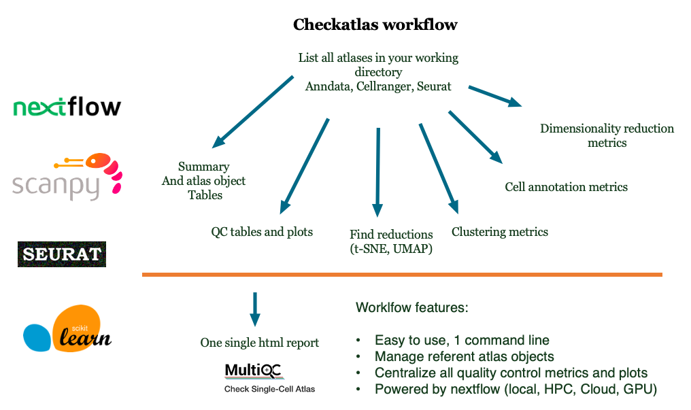

#  


[](https://codecov.io/gh/becavin-lab/checkatlas)
[](https://github.com/becavin-lab/checkatlas/actions/workflows/tests.yml)
[](https://checkatlas.readthedocs.io/en/latest/?badge=latest)
[](https://app.gitter.im/#/room/!KpJcsVTOlGjwJgtLwF:gitter.im)


CheckAtlas is a one liner tool to check the quality of your single-cell atlases. For every atlas, it produces the
quality control tables and figures which can be then processed by multiqc. CheckAtlas is able to check the quality of Scanpy, Seurat,
and CellRanger files.


## Summary

Powered by nextflow, checkatlas can be ran in one command line:

```bash
nextflow run nf-core-checkatlas -r dev --path search_folder/
```

The checkatlas workflow start with a fast crawl through your working directory. It detects Seurat (.rds), Scanpy (.h5ad) or cellranger (.h5) atlas files.

Then, it goes through all atlas files and produce summary information:

- All basic QC (nRNA, nFeature, ratio_mito)
- General information (nbcells, nbgenes, nblayers)
- All elements in atlas files (obs, obsm, uns, var, varm)
- Reductions (pca, umap, tsne)
- All metrics (clustering, annotation, dimreduction, specificity)

All tables and figs are saved in the **checkatlas_files** folder in your search folder.

A single html report is produced, using MultiQC, in **checkatlas_files/Checkatlas-MultiQC.html**.


