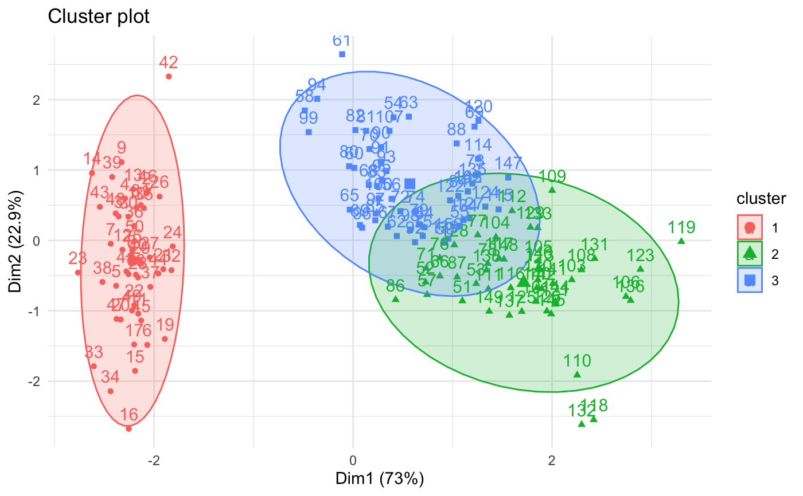

# Silhouette Clustering Metric Analysis

## Description

The Silhouette is a method for interpretation and validation of consistency within data clusters. This technique provides a succinct graphical representation of how well each object has been classified.
The silhouette value measures how similar an object is to its own cluster (cohesion) compared to other clusters (separation). Values range from $-1$ to $+1$, where a high value indicates that the object is well matched to its own cluster and poorly matched to neighboring clusters.
The metric is specialized for measuring cluster quality when clusters are convex-shaped and may not perform well if data clusters have irregular shapes or varying sizes.

A clustering with an average silhouette width greater than $0.7$ is considered "strong", greater than $0.5$ "reasonable" and greater than $0.25$ "weak". 

> © [factoextra](https://rpkgs.datanovia.com/factoextra/reference/fviz_silhouette.html)

## Formulas

For a data point $i$ in cluster $C_I$, we define:

### *Intra-cluster distance (cohesion)*

$a(i)$ represents the average distance between $i$ and all other points in the same cluster.

$$
a(i)=\frac{1}{|Ci|-1}\displaystyle\sum{j \in C_i}^{j \neq i}d(i,j)
$$

where : 

- $C_i$ is the number of points in the cluster

- $d(i,j)$ is the distance between points $i$ and $j$

### *Inter-cluster distance (separation)*

$b(i)$ represents the minimum average distance from $i$ to all points in any other cluster.

$$
b(i)=\displaystyle\min_{k\neq I}\{\frac{1}{|C_k|}\displaystyle\sum_{j \in C_k} d(i,j)\}
$$

### *Silhouette Value*

The silhouette value $s(i)$ is defined by :

$$
s(i) =\frac{b(i) - a(i)}{\max(a(i),b(i))}
$$

### Sources 

[Wikipedia](https://en.wikipedia.org/wiki/Silhouette_(clustering))

[Peter J. ROUSSEEUW. « Silhouettes : A graphical aid to the interpretation and validation of cluster analysis ». In : Journal of Computational and Applied Mathematics 20 (nov. 1987).](https://doi.org/10.1016/0377-0427(87)90125-7)

Applying Deep Learning algorithm to perform lung cells annotation, A. Collin

## Computation strategy

### Default: Centroid-Variance Approximation (bluster method)

For large single-cell atlases, computing the full $N \times N$ pairwise distance matrix ($O(N^2 \cdot d)$) is prohibitively expensive. CheckAtlas uses the **Centroid-Variance Approximation** as its default computation strategy, which reduces complexity to $O(N \cdot K \cdot d)$ where $K$ is the number of clusters (typically $K < 50$).

Instead of calculating the average distance from cell $i$ to every cell in cluster $C_X$, we approximate it using the distance to the cluster centroid and the cluster's internal variance:

$$
\tilde{D}(i, C_X) = \sqrt{\text{dist}(i, \mu_X)^2 + \sigma_X^2}
$$

where $\mu_X$ is the centroid of cluster $C_X$, and $\sigma_X^2$ is the summed variance of all features across all cells in $C_X$ (a constant per cluster).

This formula is mathematically equivalent to the root-mean-squared (RMS) distance from cell $i$ to all cells in $C_X$, derived from the identity:

$$
\frac{1}{|C_X|}\sum_{j \in C_X} \|x_i - x_j\|^2 = \|x_i - \mu_X\|^2 + \frac{1}{|C_X|}\sum_{j \in C_X} \|x_j - \mu_X\|^2
$$

The approximation is highly accurate in practice: relative error is typically below $0.5\%$ while reducing execution time from hours to seconds on large datasets.

### Exact computation

For precise values or small datasets, pass `method="exact"` to use the full $O(N^2 \cdot d)$ pairwise distance computation via scikit-learn. When a precomputed distance matrix (TriangularMatrix `.tri` file) is available, it is used directly for an exact result with zero distance-computation cost.

### Sources 

[Wikipedia](https://en.wikipedia.org/wiki/Silhouette_(clustering))

[Peter J. ROUSSEEUW. « Silhouettes : A graphical aid to the interpretation and validation of cluster analysis ». In : Journal of Computational and Applied Mathematics 20 (nov. 1987).](https://doi.org/10.1016/0377-0427(87)90125-7)

Applying Deep Learning algorithm to perform lung cells annotation, A. Collin

[Aaron Lun. bluster: Clustering Algorithms for Bioconductor. Bioconductor.](https://bioconductor.org/packages/bluster)

### Code 

[Scikit](https://scikit-learn.org/stable/modules/generated/sklearn.metrics.silhouette_score.html)

