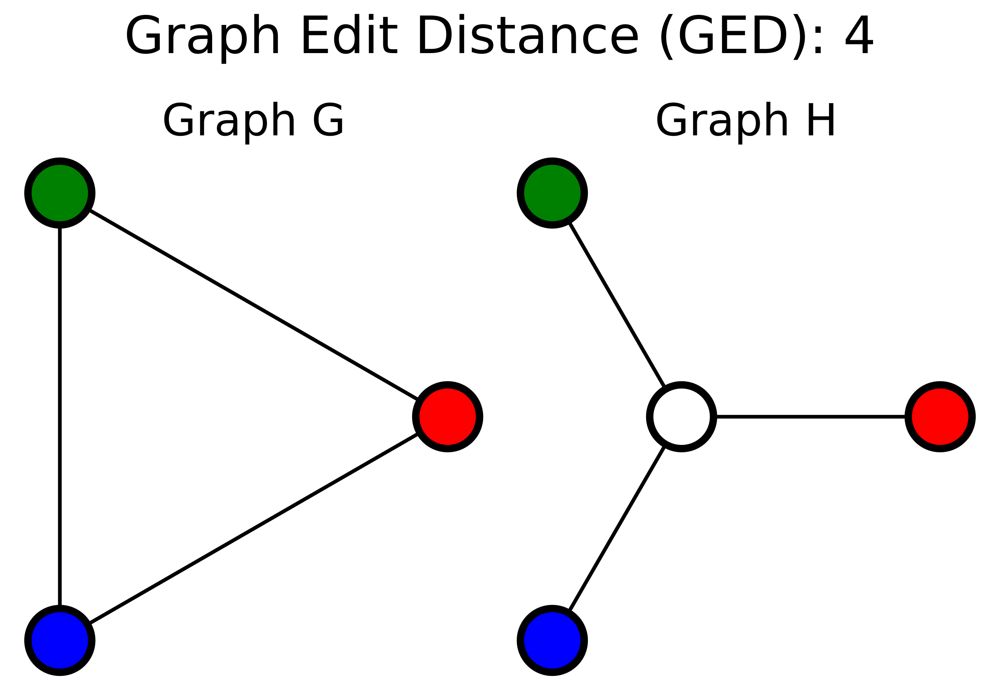

# Graph Edit Distance (GED)

## Description 

Graph Edit Distance (GED) is a graph similarity (or dissimilarity) metric that quantifies the minimum number of operations needed to transform one graph into another. 
These operations include insertion, deletion, or substitution of nodes and edges. 
In the context of single-cell RNA-seq, Cooley et al. (2021) use GED to compare the minimum spanning trees (MSTs) derived from the high-dimensional data and its low-dimensional embedding. 
This allows them to evaluate how much the global topology of the dataset is altered by dimensionality reduction. 
A GED of zero indicates identical graphs, while higher values indicate increasing structural distortion.

> « At first glance, the GED (graph edit distance) may appear to be 7, removing 3 edges, adding the white vertex, and adding edges between it and the 3 other vertices. However, the optimal set of operations would be to remove the edge between 2 colors of choice (for example, red and blue), change the third (green) to white, add a vertex of the now missing color (green), and connect it to the newly white vertex, for a GED of 4. » [Wikipedia](https://en.wikipedia.org/wiki/Graph_edit_distance)
>
> © [Wikimedia](https://upload.wikimedia.org/wikipedia/commons/thumb/1/18/Graph_edit_distance.svg/620px-Graph_edit_distance.svg.png)

## Formulas 

Given two graphs $G$ and $H$, the Graph Edit Distance is defined as :

$$
GED(G, H) = \min_{p \in P(G, H)} \sum_{e_i \in p} c(e_i)
$$

where:

- $P(G, H)$ is the set of all sequences of edit operations transforming $G$ into $H$,

- $c(e_i)$ is the cost of the $i$-th edit operation in the sequence $p$.

In the application by Cooley et al., the cost $c(e_i)$ is set to 1 for insertions or deletions of vertices or edges. GED is :

- 0 if the graphs are identical,

- non-negative in general ($GED \geq 0$),

- unbounded above, depending on the number of necessary edits.

For trees with $N$ nodes, the MST has $N-1$ edges, and GED can reach up to $2(N - 1)$ in extreme cases.

## Sources 

[Wikipedia](https://en.wikipedia.org/wiki/Graph_edit_distance)

[Cooley S. M. et al. (2021), *A novel metric reveals previously unrecognized distortion in dimensionality reduction of scRNA-seq data*.](https://doi.org/10.1101/689851)

## Code 

[Github](https://github.com/topics/graph-edit-distance)
