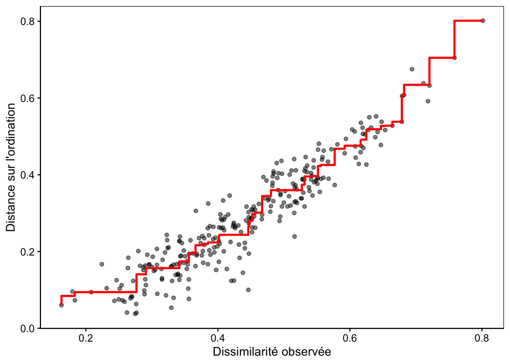

# Kruskal's stress 

## Description 

Kruskal Stress is a fundamental metric for evaluating the quality of representation in Multidimensional Scaling (MDS). 
It measures the discrepancy between distances in the reduced representation space and the original data dissimilarities. 
This metric quantifies the information loss during dimensionality reduction, allowing to assess whether the projection in reduced dimensions faithfully preserves proximity relationships between points.
Stress ranges from 0 (perfect representation) to 1 (highly distorted representation).
It allows validation of the quality of high-dimensional data visualizations (i.e. datasets with a large number of variables that pose problems).

> « On the x-axis, we have the dissimilarity values present in the distance matrix. On the y-axis, the graph represents the ordination distances, i.e. the distances between pairs of points on the map. » [sciviews.org](https://wp.sciviews.org/sdd-umons2-2022/positionnement-multidimensionnel-mds.html)
> 
> © [sciviews.org](https://wp.sciviews.org/sdd-umons2-2022/09-db-mds_files/figure-html/unnamed-chunk-54-1.png)

## Formulas 

Stress : 

$$
KS = \sqrt{\frac{\displaystyle\sum_{i \lt j} (d_{ij} - \hat{d}_{ij})^2}{\displaystyle\sum_{i \lt j} d_{ij}^2}}
$$

where : 

- $d_{ij}$ is the Euclidean distance between points $i$ and $j$ in the reduced representation space

- $\hat{d}_{ij}$ represents the transformed dissimilarity (or proximity) between objects $i$ and $j$ in the original space

### *Interpretation Criteria* :

- Stress < 0.05: Excellent representation

- 0.05 ≤ Stress < 0.1: Good representation

- 0.10 ≤ Stress < 0.15: Acceptable representation

- 0.15 ≤ Stress < 0.20: Poor representation

- Stress ≥ 0.20: Unacceptable representation

## Sources 

[Wikipedia](https://en.wikipedia.org/wiki/Multidimensional_scaling)

[NormaleSup](https://www.normalesup.org/~carpenti/Notes/MDS/MDS-metrique.html)

“Applying Deep Learning algorithm to perform lung cells annotation”, A. Collin, 2020

[Antonio GRACIA et al. A methodology to compare Dimensionality Reduction algorithms in terms of loss of quality. Rapp. tech. 2014](https://www.sciencedirect.com/science/article/pii/S0020025514001741)
  

## Code

[R](https://www.normalesup.org/~carpenti/Notes/MDS/MDS-metrique.html)

