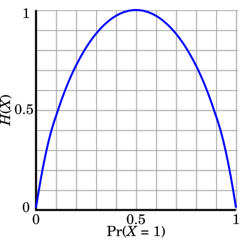

# Shannon's entropy

## Description 

Shannon entropy is a measure of uncertainty or diversity in a probability distribution. In bioinformatics, it is often used to evaluate tissue specificity: each gene has an expression profile across multiple tissues, and entropy quantifies how "focused" or "broad" this expression is.

- Low entropy $\rightarrow$ expression restricted to few tissues (tissue-specific).

- High entropy $\rightarrow$ more widespread expression (ubiquitous).

> « Entropy $Η(X)$ (i.e. the expected surprisal) of a coin flip, measured in bits, graphed versus the bias of the coin $Pr(X = 1)$, where $X = 1$ represents a result of heads. » [Wikipedia](https://en.wikipedia.org/wiki/Entropy_(information_theory))
>
> © [Wikimedia](https://upload.wikimedia.org/wikipedia/commons/thumb/2/22/Binary_entropy_plot.svg/400px-Binary_entropy_plot.svg.png)

## Formulas

### *Basics* 

For a random variable $X$ taking values $i$ with probabilities $p_i$ :

$$
H(X) = -\displaystyle\sum_{i} p_i \log_b(p_i)
$$

where $b$ is the logarithm base.

### *Properties* :

- $H(X) \geq 0$, with equality if one $p_i = 1$

- Maximum entropy: $H(X) = \log_2(n)$ when the distribution is uniform over $n$ elements

- Additivity: $H(X, Y) = H(X) + H(Y)$ if $X$ and $Y$ are independent

## Sources

“Applying Deep Learning algorithm to perform lung cells annotation”, A. Collin, 2020

[Wikipedia](https://en.wikipedia.org/wiki/Entropy_(information_theory))

[Wikipedia](https://fr.wikipedia.org/wiki/Entropie_de_Shannon)

[Jonathan SCHUG et al. « Promoter features related to tissue specificity as measured by Shannon entropy. » In : Genome biology 6.4 (avr. 2005).](https://doi.org/10.1186/gb-2005-6-4-r33)

## Code

[Scipy](https://docs.scipy.org/doc/scipy/reference/generated/scipy.stats.entropy.html)
