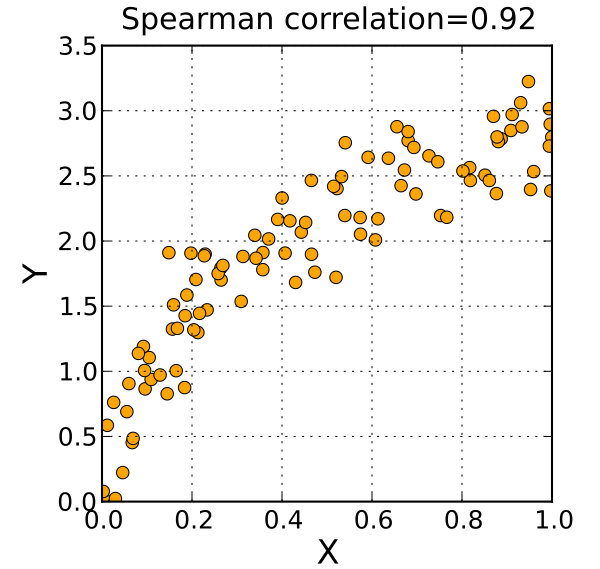

# Spearman's rho 

## Description 

Spearman's rank correlation coefficient (Spearman's rho) is a non-parametric measure of the strength and direction of a monotonic relationship between two variables. 
It evaluates how well the relationship between two sets of rankings can be described using a monotonic function.
In dimensionality reduction (DR) contexts, it is used to compare the relative order of distances or similarities before and after projection, helping quantify quality loss due to projection.

> « A positive Spearman correlation coefficient corresponds to an increasing monotonic trend between X and Y. »
> 
> « A negative Spearman correlation coefficient corresponds to a decreasing monotonic trend between X and Y. »
> 
>[Wikipedia](https://en.wikipedia.org/wiki/Spearman%27s_rank_correlation_coefficient)
> 
> © [Wikimedia](https://upload.wikimedia.org/wikipedia/commons/thumb/a/a6/Spearman_fig4.svg/600px-Spearman_fig4.svg.png)

## Formulas 

Given two variables $X=(x_1,...,x_n)$ and $Y=(y_1,...,y_n)$, and their respective ranks $R(x_i)$ and $R(y_i)$, Spearman's rho is computed as : 

$$
\rho=1-\frac{6 \displaystyle\sum_{i=1}^{n} d_{i}^{2}} {n(n^2 -1)}
$$

where, 

- $d_i=R(x_i)-R(y_i)$ is the diference between the ranks of each pair

- $n$ is the number of observations

## Sources 

[Gracia, A. et al. A methodology to compare Dimensionality Reduction algorithms in terms of loss of quality, Tech. Rep. 2014](https://www.sciencedirect.com/science/article/pii/S0020025514001741)

[Wikipedia](https://en.wikipedia.org/wiki/Spearman%27s_rank_correlation_coefficient)

“Applying Deep Learning algorithm to perform lung cells annotation”, A. Collin, 2020

## Code

[Scipy](https://docs.scipy.org/doc/scipy/reference/generated/scipy.stats.spearmanr.html)

[Wikipedia](https://en.wikipedia.org/wiki/Spearman%27s_rank_correlation_coefficient)
